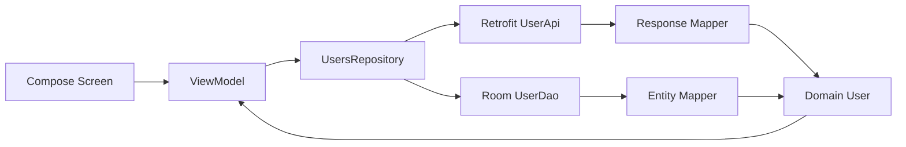

# ZeroToExpera Android TDD

Android-приложение, выполненное как тестовое задание с акцентом на **TDD**, чистое разделение слоёв и предсказуемую обработку сетевых состояний.

Приложение загружает пользователей из публичного API [JSONPlaceholder](https://jsonplaceholder.typicode.com/), кеширует данные локально в Room и показывает список пользователей с переходом на экран деталей.

## Что умеет приложение

- Показывает список пользователей из `GET /users`.
- Открывает детальную карточку пользователя из локального кеша.
- Сохраняет загруженных пользователей в Room.
- Показывает кешированные данные при ошибке сети.
- Отображает offline-баннер для данных из кеша.
- Поддерживает pull-to-refresh для принудительного обновления.
- Обрабатывает типовые сетевые ошибки через отдельный error layer.
- Покрывает ключевую бизнес-логику unit-тестами и UI/Room-сценарии instrumented-тестами.

## Технологический стек

- **Kotlin** — основной язык проекта.
- **Jetpack Compose + Material 3** — декларативный UI.
- **Navigation 3** — навигация между списком и деталями пользователя.
- **ViewModel + StateFlow** — управление состоянием экранов.
- **Koin** — dependency injection.
- **Retrofit + OkHttp + Gson** — сетевой слой.
- **Room** — локальный кеш пользователей.
- **Kotlinx Serialization** — сериализация nav routes.
- **JUnit** — локальные JVM-тесты.
- **AndroidX Test / Espresso / Compose UI Test** — instrumented и UI-тесты.

Актуальные версии зависимостей хранятся в `gradle/libs.versions.toml`.

## API

Используется публичный REST API:

```text
Base URL: https://jsonplaceholder.typicode.com/
Endpoint: GET /users
Auth: не требуется
```

Из ответа используются основные данные пользователя:

- `id`, `name`, `username`, `email`
- `address.street`, `address.suite`, `address.city`, `address.zipcode`, `address.geo`
- `phone`, `website`
- `company.name`, `company.catchPhrase`, `company.bs`

Сетевой слой построен вокруг `Retrofit`, `OkHttpClient` и `ServerErrorInterceptor`, который переводит HTTP-ошибки и пустые ответы в типизированные ошибки приложения.

## Архитектура

Проект разделён на `core`, `app` и feature-модуль `users`.

```text
app/src/main/java/kg/birsom/zerotoexperaandroidtdd/
├── app/
│   ├── UsersApp.kt                 # Compose navigation graph
│   ├── ZeroToExperaApplication.kt  # Koin bootstrap
│   └── di/                         # DI modules
├── core/
│   ├── database/                   # Room database factory
│   ├── network/                    # Retrofit, OkHttp, errors, connectivity
│   └── ui/theme/                   # Compose theme
└── feature/users/
    ├── data/
    │   ├── local/                  # Room entity + DAO
    │   ├── remote/                 # Retrofit API + response models
    │   ├── mapper/                 # DTO/Entity -> Domain mapping
    │   └── repository/             # Repository implementation
    ├── domain/
    │   ├── model/                  # Domain models and result types
    │   └── repository/             # Repository contract
    └── presentation/
        ├── list/                   # Users list screen + ViewModel
        ├── detail/                 # User details screen + ViewModel
        └── common/                 # Shared UI components/text helpers
```

### Data flow



## Поведение кеша

- Обычная загрузка сначала пытается получить свежие данные из API.
- При успешном ответе пользователи сохраняются в Room через `replaceUsers`.
- Если сеть недоступна или API вернул ошибку, репозиторий возвращает кеш, если он есть.
- Если кеша нет, UI получает типизированную ошибку.
- Pull-to-refresh выполняет `forceUpdate = true`: при ошибке показывает ошибку обновления без fallback на кеш.
- Детальный экран читает пользователя из локального кеша по `id`.

## Тестирование и TDD

Проект сделан вокруг проверяемых сценариев: сначала фиксируется поведение, затем реализация доводится до зелёных тестов.

### Unit-тесты

Локальные тесты находятся в:

```text
app/src/test/java/kg/birsom/zerotoexperaandroidtdd/
```

Покрывают:

- маппинг API response в domain model;
- маппинг Room entity в domain model;
- обработку сетевых ошибок;
- поведение `UsersRepository`;
- состояния `UsersViewModel`;
- состояния `UserDetailsViewModel`.

### Instrumented/UI-тесты

Instrumented-тесты находятся в:

```text
app/src/androidTest/java/kg/birsom/zerotoexperaandroidtdd/
```

Покрывают:

- отображение списка пользователей;
- loading/error/offline состояния;
- pull-to-refresh;
- клик по пользователю;
- экран деталей пользователя;
- работу `UserDao` на in-memory Room базе.

## Команды

Запустить unit-тесты всего проекта:

```bash
./gradlew test
```

Запустить unit-тесты app-модуля:

```bash
./gradlew :app:test
```

Запустить instrumented-тесты:

```bash
./gradlew connectedAndroidTest
```

Собрать debug APK:

```bash
./gradlew :app:assembleDebug
```

## Конфигурация проекта

- **Application ID:** `kg.birsom.zerotoexperaandroidtdd`
- **minSdk:** `26`
- **targetSdk:** `36`
- **compileSdk:** `36.1`
- **Gradle Wrapper:** `9.4.1`
- **DI entry point:** `ZeroToExperaApplication`
- **Database:** `users.db`

## Что стоит посмотреть в коде

- `UsersRepositoryImpl` — логика API/cache/error fallback.
- `UsersViewModel` — состояние списка, refresh и восстановление кеша.
- `UserDetailsViewModel` — загрузка деталей пользователя по `id`.
- `NetworkErrorHandler` — преобразование исключений в доменные сетевые ошибки.
- `UsersScreenUiTest` и `UserDetailsScreenUiTest` — UI-сценарии через test tags.
- `UserDaoTest` — проверка локального кеша на Room.

## Идеи для развития

- Добавить экран поиска или фильтрации пользователей.
- Добавить pagination, если API будет поддерживать постраничную загрузку.
- Подключить CI с запуском `:app:test`.
- Добавить screenshot-тесты для Compose UI.
- Вынести common test fixtures для уменьшения дублирования в тестах.
